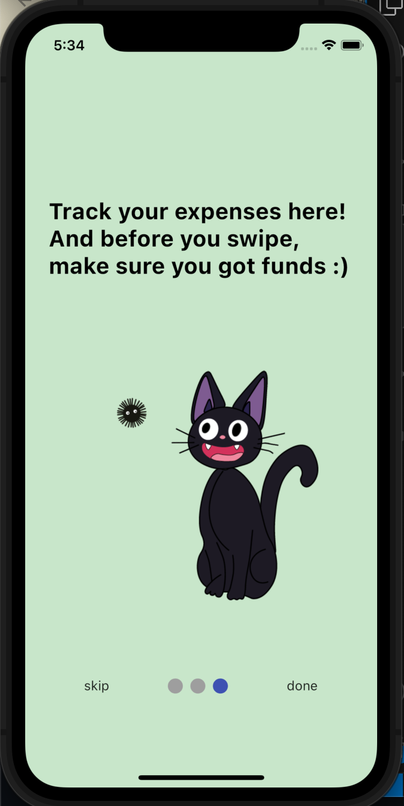
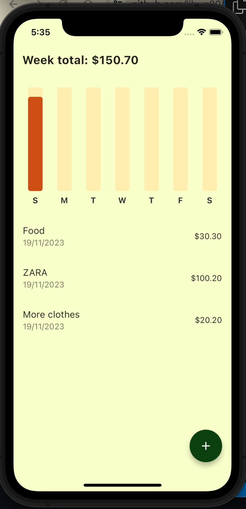
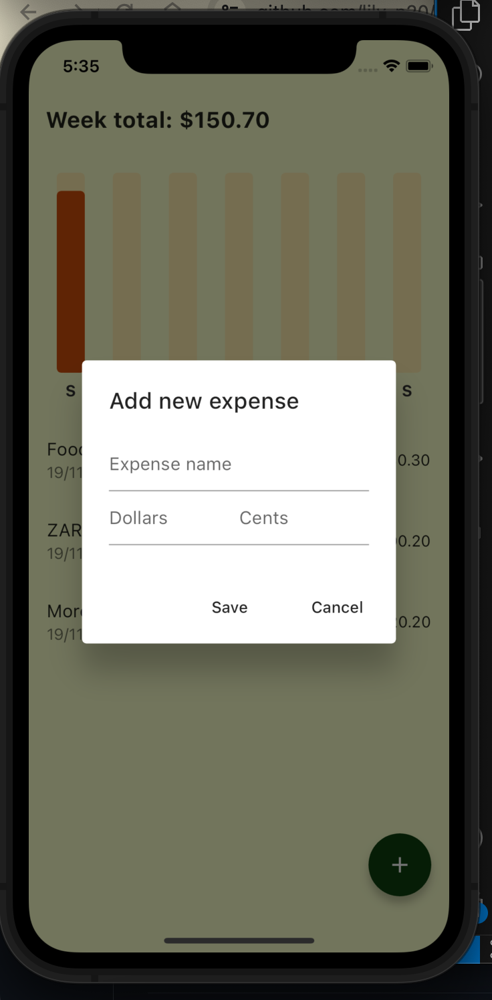

# Lumi-App

# LUMI Expense Tracker App

LUMI is a expense tracker app built using Flutter. It helps users make better informed spending decisions based on past spending habit. 


## Table of Contents

- [Features](#features)
- [Installation](#installation)
- [Usage](#usage)


## Features

- **Expense Tracking:** Weekly record of your purchases
- **Data Visualization:** View graphical representations of your spending patterns through charts and graphs.


## Screenshots






## Installation

1. **Clone the repository:**
   ```bash
   git clone https://github.com/your-username/lumi-expense-tracker.git
   cd lumi-expense-tracker

Install dependencies:
    flutter pub get

Run the app:    
    flutter run
